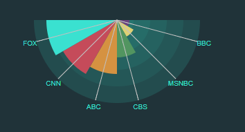

# micropolar-arc

An extension of the tiny polar charts library made with D3.js for [Plotly](https://plot.ly/). 

Forked from original project by biovisualize, [here](http://micropolar.org/).

This code adds a span parameter that allows you to control the arc length of the radials.

Allows creation of graphs like:

Code

polar-start.js

  
        var configs = [    
            //r:  Length of BLUE series
            {
              data: [            
                    {t: ['BBC', 'MSNBC', 'CBS', 'ABC', 'CNN', 'FOX'], r: [15, 0, 0, 0, 0, 0], color: '#6a447f', strokeSize: 0, name: 'Layer1', geometry: 'AreaChart', groupId: 0},
                    {t: ['BBC', 'MSNBC', 'CBS', 'ABC', 'CNN', 'FOX'], r: [0, 23, 0, 0, 0, 0], color: '#dfd075', name: 'Layer2', geometry: 'AreaChart', groupId: 0},
                    {t: ['BBC', 'MSNBC', 'CBS', 'ABC', 'CNN', 'FOX'], r: [0, 0, 45, 0, 0, 0], color: '#529560', name: 'Layer3', geometry: 'AreaChart', groupId: 0},
                    {t: ['BBC', 'MSNBC', 'CBS', 'ABC', 'CNN', 'FOX'], r: [0, 0, 0, 65, 0, 0], color: '#d59241', name: 'Layer4', geometry: 'AreaChart', groupId: 0},
                    {t: ['BBC', 'MSNBC', 'CBS', 'ABC', 'CNN', 'FOX'], r: [0, 0, 0, 0, 75, 0], color: '#c54b5a', name: 'Layer5', geometry: 'AreaChart', groupId: 0},
                    {t: ['BBC', 'MSNBC', 'CBS', 'ABC', 'CNN', 'FOX'], r: [0, 0, 0, 0, 0, 85], color: '#3ae1d0', name: 'Layer6', geometry: 'AreaChart', groupId: 0}
                    //{t: ['BBC', 'MSNBC', 'CBS', 'ABC', 'CNN', 'FOX'], r: [15, 23, 45, 65, 75, 85], name: 'Layer6', geometry: 'AreaChart', groupId: 0}
                  ],
              
              layout: { title: '', width: 300, height: 300, margin: { left: 30, right: 30, top: -200, bottom: 00, pad: 0 }, 
                font: { family: 'Arial, sans-serif', size: 10, color: '#3ae1d0' },
                direction: 'clockwise', 
                orientation: 375, 
                span: 180,
                reverseOrder: true,
                radialAxis: { visible: false},
                barmode: 'stack', backgroundColor: '#3ae1d0', showLegend: false }
            }            
        ];

        configs.forEach(function(_config){
            var config = {layout: {width: 300, height: 300}};
            µ.util.deepExtend(config, _config);
            console.log(JSON.stringify(µ.adapter.plotly().convert(config, true)));
            var ms =micropolararc.Axis().config(config).render(d3.select('#polarcontainer').append('div'));
            var ms =micropolararc.Axis().config(config).render(d3.select('#polarcontainer2').append('div'));

        });

index.htm

        <!DOCTYPE html>
        <html lang="en">
          <head>
                        
            
            
            

          </head>
          <body>     
            
      
              
              
      
                

                  

                
                    
              

            
      
            
            
          </body>
        </html>
